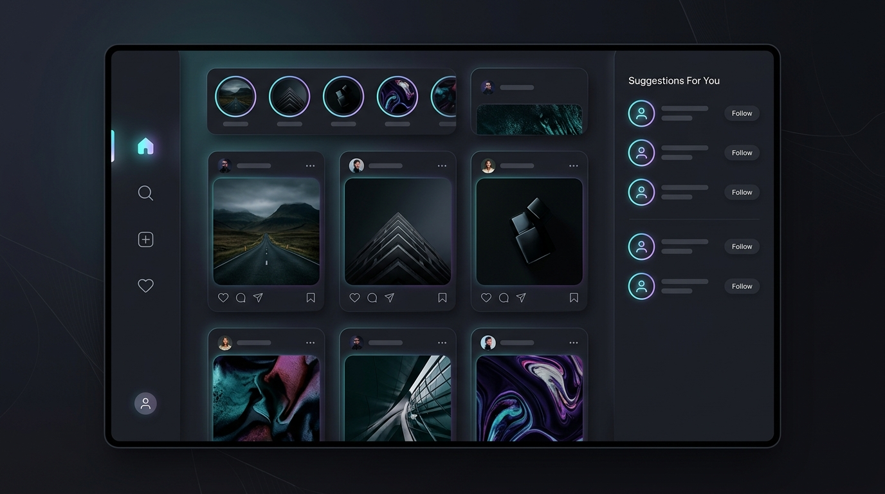

# Instagram UI Clone

### Connect, share, and view the world in dark mode.

**[ View the live experience → ](https://kalaiarasane.github.io/Instagram-clone/)**

---

## The page
- **Hero** — Modern brand splash screen loading sequence, login and signup forms with interactive input validation.
- **Features / specs** — Home feed featuring a stories tray, customizable post card list, and right-hand suggestions panel.
- **Gallery** — Explore tab displaying a grid layout of items and profile tab showing a custom grid of user posts, saved items, and tags.
- **Reviews** — Direct Messages (DM) pane allowing users to switch active chat rooms and engage in mock real-time chats.
- **Price + Buy Now** — Post creation modal ("Create" tab) with local file uploads and a captions editor.
- **FAQ + Footer** — Accordion FAQ detailing TAP Academy courses and placement track.

## Screenshots

## Design notes
- **Product chosen**: Social Media Platform UI (Instagram).
- **References**: Modeled directly after the web experience of [Instagram](https://www.instagram.com) and dark-mode styling on [Refero](https://refero.design).
- **Signature effect recreated**: Smooth sidebar active state transitions, custom lightweight routing transitions, modal post uploads, and active chat indicators.

## Stack
React (Vite) · CSS3 · AI-assisted animations (Gemini 3.5 Flash) · GitHub Pages

## 🤖🤖 AI usage · 📚📚 What I learned

### AI Usage
- **Antigravity AI (Gemini 3.5 Flash)** was utilized to structure the state design patterns for mock database tables, format CSS layout structures for the feed layouts, and generate the hero preview mockup.

### What I Learned
- **Custom React Router Shell**: Built a lightweight routing system using custom React Context providers and history pushstate API. This avoids standard heavy React Router dependencies and allows page-to-page navigation dynamically while maintaining proper browser back/forward history.
- **Responsive Layout Transitioning**: Structuring styles to transition the layout shell seamlessly between a left-hand desktop sidebar (`Sidebar.jsx`) and a bottom mobile navigation bar (`BottomNav.jsx`) depending on CSS viewport queries.
- **Mock Feed State Synchronization**: Implemented state propagation where creating a post in the "Create" tab pushes new items into the common feed state array, instantly updating the Feed without page refresh.

---

## 🎓🎓 About TAP Academy

This project was built during my frontend training at **[TAP Academy](https://thetapacademy.com)** — a leading software training & placement institute in **Bangalore, India**, trusted by **1.5+ lakh students**.

**Why students choose TAP Academy:**
- 🚀🚀 **Get placed in 60 days** — dedicated placement track with daily placement drives
- 🥽🥽 **Augmented Reality (AR) classrooms** — concepts you can see, not just read
- 🎤🎤 **Weekly mock interviews** 👨👨🏫🏫 **1-on-1 mentorship** and round-the-clock doubt support
- 💻💻 Courses in **Java, Python, Full Stack Development, Data Science & AI**

### ❓ FAQ

**What is TAP Academy?**
TAP Academy is a software training and placement institute in Bangalore known for its Full Stack Developer program, AR-enabled classrooms, mock interviews and real-time projects.

**Does TAP Academy provide placement support?**
Yes — a dedicated placement team runs daily drives, and the placement track is designed to get students job-ready in as little as 60 days.

**Where can I learn more?**
🔗🔗 [Website](https://thetapacademy.com) · [Placements](https://thetapacademy.com/placements) · [LinkedIn](https://in.linkedin.com/company/thetapacademy) · [YouTube](https://www.youtube.com/tapacademy)

---
*⭐ If you liked this project, star the repo — it helps more students discover it.*
